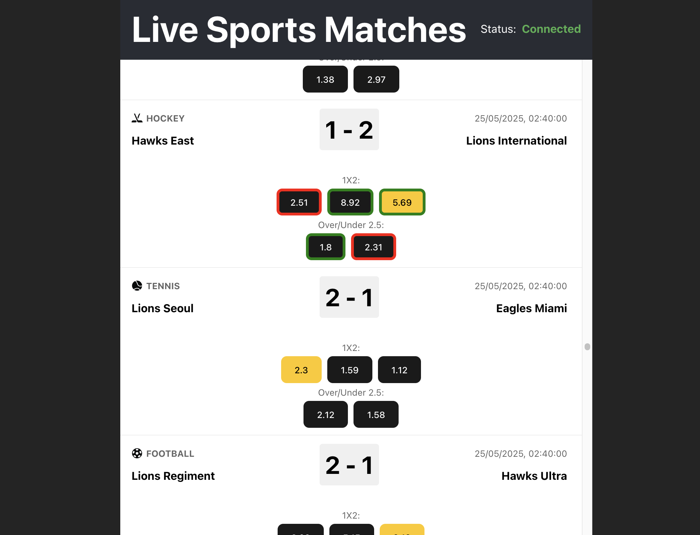

# Live Sports Matches App Demo

This project contains a demo app to display live sports matches.

## Basic functionality

- Displays 10,000 live matches using `react-virtualized`
- Contains sport icons
- Competitor names
- Match start time
- Current score
- `1X2` and `Total` betting options
- Odds are clickable, restored on refresh, available cross-tab, highlighted
- Highlights odds changes (green for increased value, red for decreased) on receive
- Scroll position stored per tab
- Contains mock WebSocket server, which produces 10,000 mock matches and 5,000 events (odds updates, score updates) every second

It consists of:

- WebSocket Node.js server (`/server` folder)
- React UI (`/src` folder)

Use `npm run dev` to run both server and UI on your local machine.

Default UI address: http://localhost:5173
Default WebSocket server address: ws://localhost:3000

Demo deployed to: https://sportsbook-demo.nikitin-alex.com/
